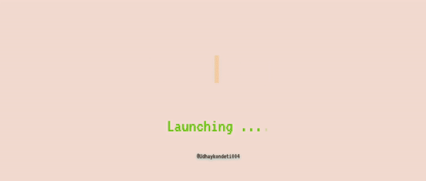

<!-- Social icons section -->
<h1 align="center"> Social Media: </h1>
  

    
    
    
  

</h1>

<!-- Description about me -->
<h2 align="center"> 🤔 About me 👨‍💻 </h2>

Eyyyy!!!  
I am <b>Kondeti Udhay</b>🕵🏼‍♂️ 
I am from <strong>India</strong> 
I'm a guy who love develop new things 🖥️  
   

### 🧐 More About Me:
<table style="border: none;">
  <tr style="border: none;">
    <td style="border: none;">
      <ul>
        <li>
          🔭 I’m currently studying at **SRMAP**
        </li>
        <li>
          🤝 I’m looking to collaborate on Open Source Proyects
        </li>
        <li>
          🌱 I’m currently learning Backend Dev; 
        </li>
        <li>
          👨🏻‍💻 Most of my projects are available on [Github](https://github.com/Udhaykondeti004?tab=repositories)
        </li>
        <li>
          💬 Ask me about anything tech related, I am happy to help
        </li>
        <li>
          📫 Feel free to contact me on [LinkedIn](https://www.linkedin.com/in/udhayk004/)
        </li>

    </td>
    <td style="border: none;">
      
    </td>
  </tr>
</table>
   

<!-- languajes and skills section -->

<h1 align="center"> Languages/Frameworks I'm good at: </h1>

  <code></code>
  <code></code>
  <code></code>
  <code></code>
    <code></code>

 

<h1 align="center"> Languages/Frameworks I'm learning: </h1>

  <code></code>
  <code></code>

 

<h1 align="center"> Environments I work with: </h1>

  <code></code>
  <code></code>

 

## 📊 Github stats

   
  
  
   
  <b>Note:</b> Top languages is only a metric of the languages my public code consists of and doesn't reflect experience or skill level.

<!-- Projects section -->

## 📘 My top open source projects

  

    
    
  

  
&#8192;

  

    
    
  

&#8192;

&#8192;

  

<!-- last activity section -->

## Activity Graph

  

 

<!-- last refresh of readme section -->

Last refresh: <b>Friday, July 14, 8:00 PM GMT-5</b>

<!---
DavidsDvm/DavidsDvm is a ✨ special ✨ repository because its `README.md` (this file) appears on your GitHub profile.
You can click the Preview link to take a look at your changes.
--->
